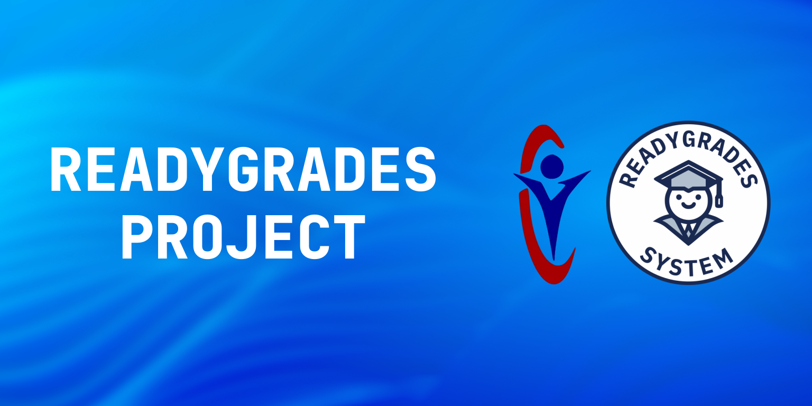
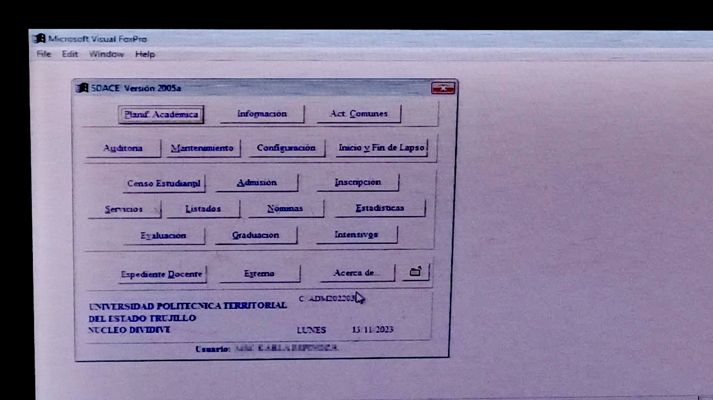

# ReadyGrade

Es un proyecto universitario para la _Universidad Politécnica Territorial del Estado Trujillo Mario Briceño Iragorry_ (U.P.T.T.M.B.I) que va dirigido principalmente para resolver el problema del antiguo y obsoleto sitema de control de notas creado en `VisualFoxPro` en el _Area De Registro y Control de Estudios_ (A.R.C.E).

>Una de las fotos tomadas del sistema que se intenta reemplazar en el A.R.C.E:
>

>[!Important]
>Este proyecto aún no esta de forma funcional en el area del profesor o del administrador básico (solo tiene el área del estudiante y del super administrador o administrador root).

## 🧑‍🎓 Estudiantes:
Los estudiantes podrán ingresar con su cédula de identidad para revisar sus datos públicos y notas obtenidas a lo largo de su trayecto de estudio (Semestres o Trimestres, dependiendo de como sea cada ciclo de estudio).

## 🧑‍🏫 Profesores:
Los profesores podrán ingresar con su usuario y contraseña creada por el administrador de la institución para subir las notas de cada estudiante de forma remota, sin necesidad de hacerlo físicamente en papel. Además tendrá la opción de imprimir las notas previamente subida para entregarla físicamente en el área de control de estudio.

## 🧑‍💼 Administradores:
Los administradores podrán en este caso podrán gestionar y administrar registros de profesores, materias de cada profesor admitido en cada materia correspondiente y administrar de forma permanente las notas de los estudiantes.

## 🔐 Super Administrador / usuario root:
Estos administradores tienen muchos mas priviliegios que los administradores convencionales.

# Usar el Proyecto

Para poder usar el proyuecto de manera correcta de forma local o los paos para subirlo a producción ve a la _wiki_ de este proyecto o dirigiendote al siguiente enlace:
[Precedimientos de Desarrollo ](https://github.com/gregoriorondon/readygrades/wiki)

>[!Warning]
>Tienes que tener en cuenta que en los procedimientos que se muestran pueden funcionar para producción pero tienes que cambiar ciertos valores de seguridad como las contraseñas de los administradores o usuarios, bases de datos, puertos, etc. para evitar fallos de seguridad cuando implementes el proyecto en alguna institución de estudios.
